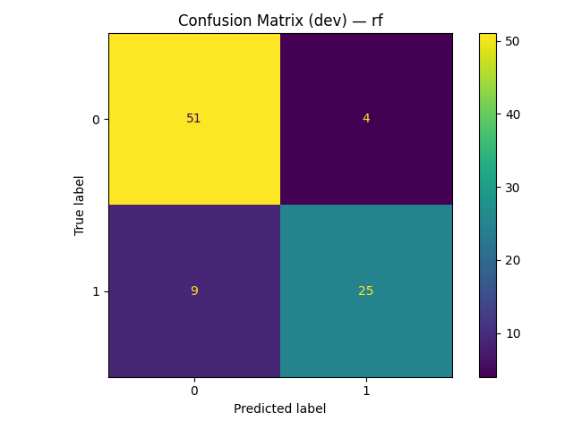
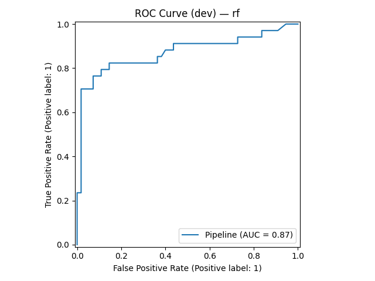

# CMPE 255 — Assignment 1: Do Data Science with ChatGPT

## Dataset
- **Kaggle:** [Titanic — Machine Learning from Disaster](https://www.kaggle.com/competitions/titanic)
- **Target:** `Survived` (0 = not survived, 1 = survived)
- **Task:** Binary classification

## Objective
Use ChatGPT as a copilot to complete an end-to-end ML workflow: data understanding, preprocessing, model training, evaluation, and reporting. Capture all artifacts and make the repository reproducible.

## Method (Summary)
- **Split:** train/dev/test with stratification on `Survived`.
- **Preprocessing:**  
  - Numeric: median imputation → standardization  
  - Categorical: most-frequent imputation → one-hot encoding
- **Models compared:** Logistic Regression vs RandomForest; choose the best on the dev set, then retrain on train+dev and evaluate on test.
- **Metrics:** Accuracy, F1 (macro), ROC-AUC.

## Key Results (Test)
- **Best model (dev):** `TODO: model_name`
- **Accuracy:** `TODO: 0.xxx`
- **F1 (macro):** `TODO: 0.xxx`
- **ROC-AUC:** `TODO: 0.xxx`

> Full numbers: [`results/test_summary.csv`](results/test_summary.csv)  
> Dev comparison: [`results/dev_scores.csv`](results/dev_scores.csv)

## Artifacts
- Dev confusion matrix:   
- Dev ROC curve (if available):   
- Test confusion matrix: `artifacts/confusion_matrix_test.png`  
- Classification report (test): [`results/classification_report_test.csv`](results/classification_report_test.csv)

## How to Reproduce
1. Click the **Open in Colab** badge above.  
2. In Colab, upload `train.csv` to `/content/` **or** run the Kaggle API cell to download the Titanic data.  
3. Run all cells top-to-bottom. Outputs will be written to `artifacts/` and `results/`.

## How ChatGPT Helped
- Planned the CRISP-DM-style workflow and generated EDA/preprocessing code.
- Suggested baseline and comparison models, metrics, and plotting code.
- Helped package outputs and write this README.

## Next Steps
- Simple feature engineering: `FamilySize`, `IsAlone`, age binning.
- Hyperparameter tuning, cross-validation, feature importance and error analysis.

- Medium article: https://medium.com/@s9070292108/from-zero-to-baseline-using-chatgpt-as-a-ds-copilot-on-kaggles-titanic-8d8d0ef1b6ea
